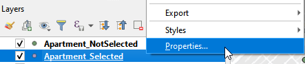

Next, we will change the layer properties: 
1. change the symbology
2. label the map.

# Symbology

### Extent

1. Right click Apartment_Selected and choose Properties. 
 

Open Properties window (a)

2. Select Single Symbol. Click Marker and select effect drop shadow. 
 

3. Select the second Simpler maker and remove it. 
 
1[Figure 55. Delete the Single Marker](../fig/)

4. Switch to Apartment_NotSelected layer and open Properties. 
 

5. Also select Single symbol. Choose diamond green. 
 

6. Select the Simple Marker. Go to Fill color and check Transparent Fill.
 

7. Change the symbol of GroceryStore_sp. Go to the Properties. 
 

8. Follow the similar procedures of changing the symbol for Aparment_Selected to change the Marker for GroceryStore_sp. Choose dot orange and make the marker transparent. 
 

9. Change the symbol for Neighborhood_sp layer. Open properties. Choose Single symbol and click Simple fill. In Fill color, check Transparent Fill. 
 

# Add labels

### Extent

We want to label the selected apartments with the prices.

1. Open Properties of Apartment_Selected layer. 
 

2. On the left panel, select Labels. On the right panel, from the top select Single Label. Select Price for Value. 



