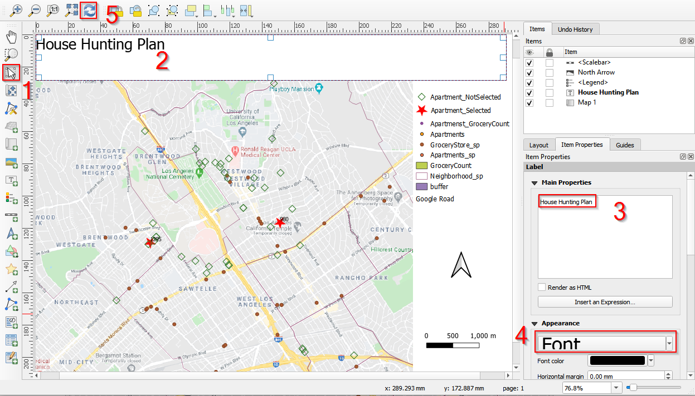
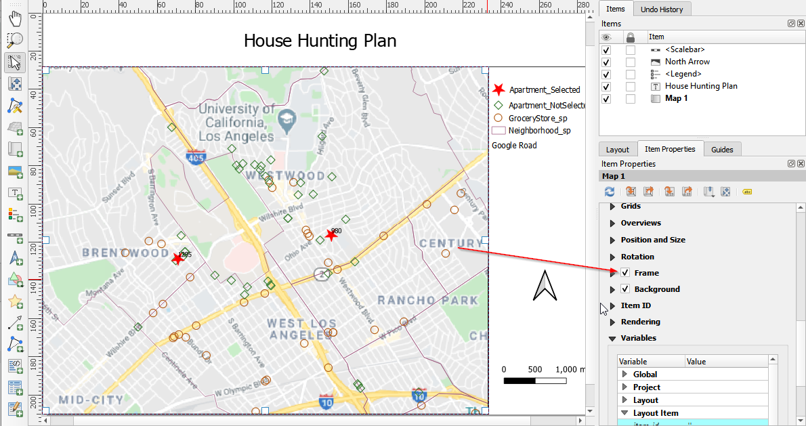
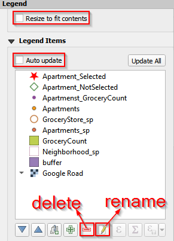

# Create the print layout

Changing the properties of the layers, we are ready for making and exporting a map. 
1. In the Menu, find Project and choose New Print Layout. 

New print layout
{: .text-center}

2. Name the print layout as House Hunting Plan
 

Name the new print layout
{: .text-center}

3. The layout of the Print Layout.

Layout of the new print layout
{: .text-center}

4. Use the tools in the Toobox bar to draw rectangles in the Canvas and add different elements for a map, such as title, map, legend, north arrow, and scale. 
 

Add elements to make a map
{: .text-center}

5. * (1) Click Select/Move item button in the Toolbox bar
   * (2) select the title. 
   * (3) In the Properties panel, change the title as House Hunting Plan.
   * (4) Move blow and change the Font to fit the map. If there is no change after changing the properties
   * (5) click refresh. 
 

Change properties of the title
{: .text-center}

6. Scroll down the Properties panel, select Center for Horizontal alignment and Middle for Vertical alignment. Check Frame to add the frame to the title. 
 

Center the title horizontally and vertically
{: .text-center}
 

Add frame to the title
{: .text-center}

7. Select the map and add a frame to the map in the Properties panel. 
 

Add frame the map
{: .text-center}

8. Click the legend and change the properties of legend. Uncheck Resize to fit contents and Auto update. Delete some layers and only keep the layers we want to show in the map: Apartement_Selected, Apartment_NotSelected, GroceryStore_sp, Neighborhood_sp, and Google Road. 
 

Customize the legend (a)
{: .text-center}
 

Export the map
{: .text-center}

# Save the project

We did a simple spatial analysis and made the first map! Good job! Next step is saving the project. 

1. In the print layout window, click Layout in the Menu bar. Save Project. This will save both the edited map and the print layout. 
 

Save the project from print layout view
{: .text-center}

2. Another way to save the project is: switching back to QGIS layout view, choosing Project and Save the project as HouseHuntingPlan.  
 

Save the project from main menu
{: .text-center}
 

Save the project as HouseHuntingPlan
{: .text-center}



